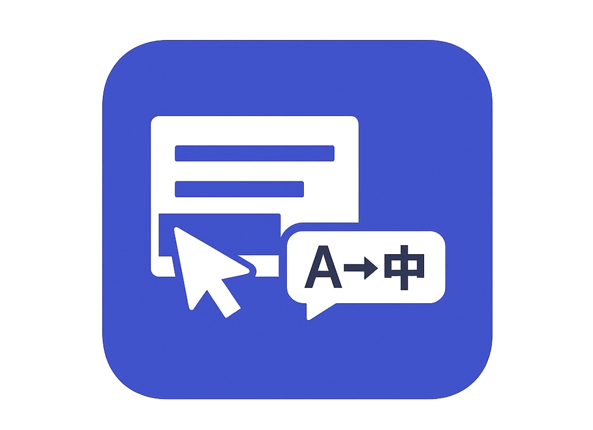
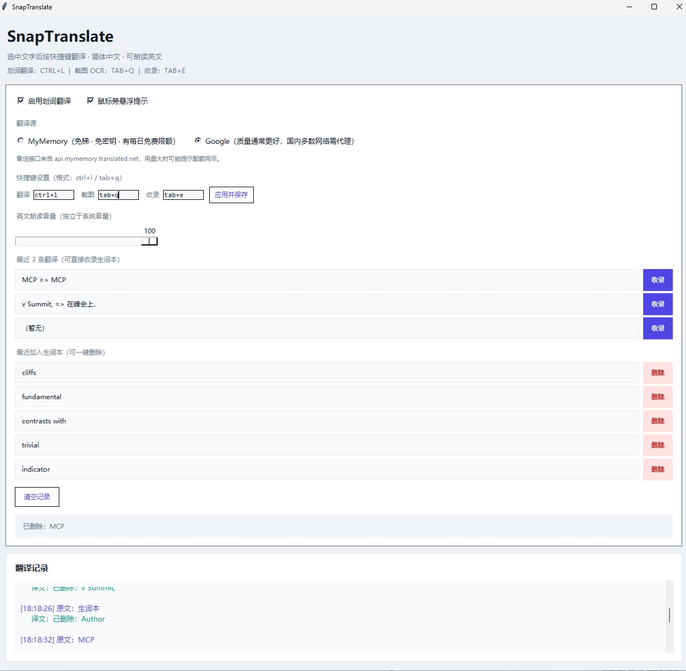
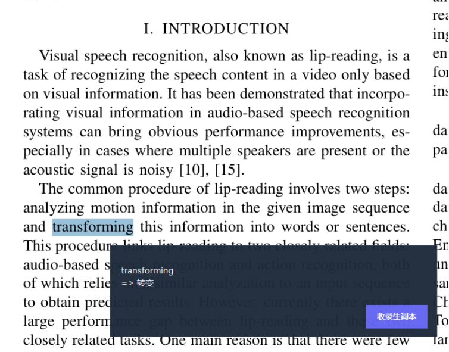
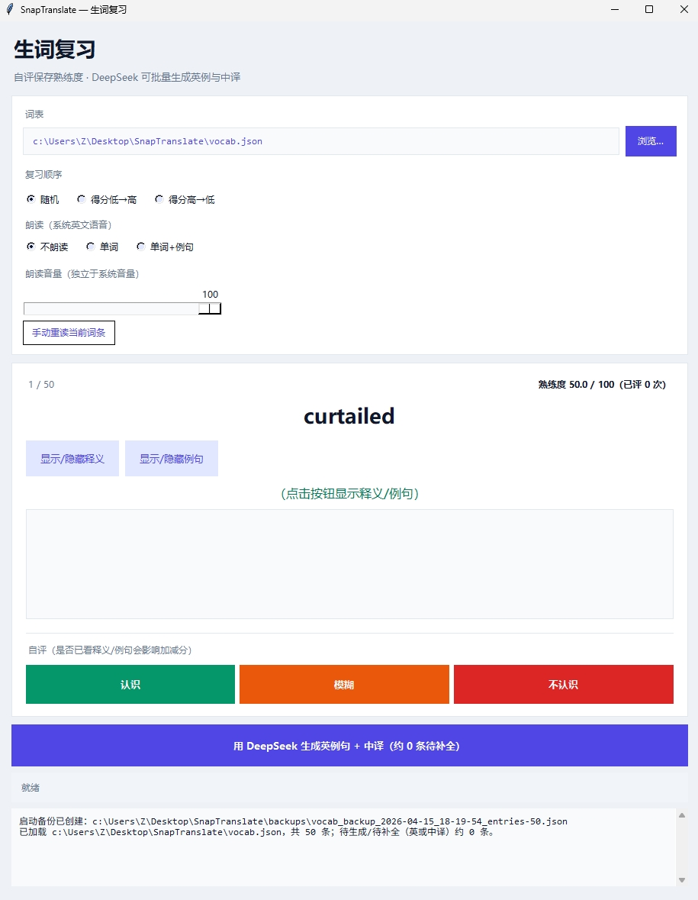
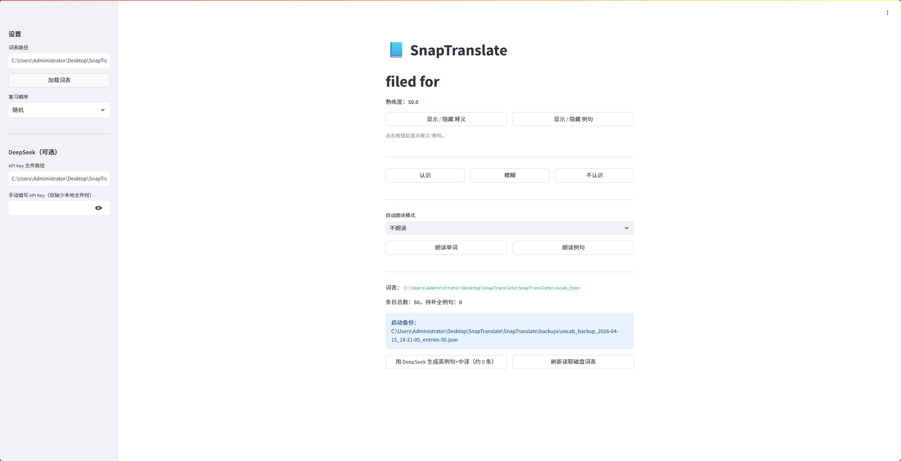
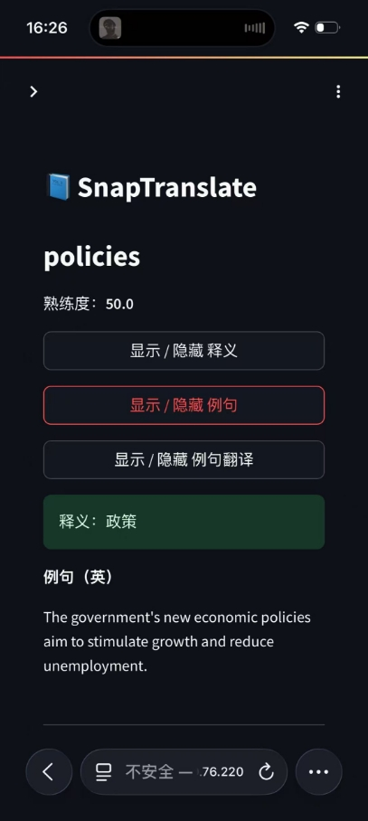
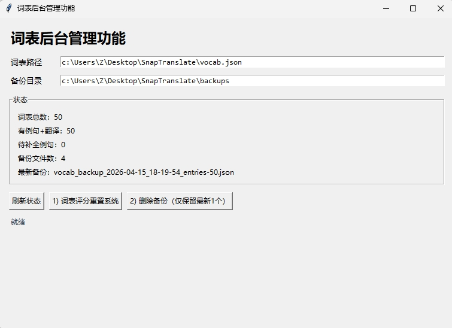

# SnapTranslate

一个围绕英语学习场景的本地工具集，包含：

1. 划词翻译与生词记录  
2. 生词本复习（电脑端 + Web 端）  
3. 生词后台管理功能



---

## 快速开始

```powershell
cd path\to\SnapTranslate
pip install -r requirements.txt
```

- 划词翻译（桌面）：`python main.py`
- 生词复习（桌面）：`python vocab_review.py`
- 生词复习（Web）：`streamlit run vocab_review_web.py`
- 生词后台管理（桌面）：`python reset_vocab_scores.py`

---

## 一、划词翻译与生词记录（`main.py`）




### 1) 全局热键与翻译

- 默认快捷键：
  - `Ctrl + L`：划词翻译（翻译到简体中文）
  - `Tab + Q`：截图 OCR 翻译
  - `Tab + E`：收录最近一条翻译到生词本
- 支持在主界面自定义快捷键（示例：`ctrl+l`、`tab+q`）
- 快捷键配置会持久化到 `main_settings.json`，下次启动自动复用
- 翻译源可选：`Google` / `MyMemory`
- 内置重试、超时与缓存（弱网场景更稳）

### 2) 界面与交互

- 主窗口显示翻译历史、状态栏、最近 3 条结果
- 可开启“鼠标旁悬浮提示”显示原文与译文
- 最近 3 条可直接“收录”进 `vocab.json`
- 新增“最近加入生词本”列表，支持一键删除词条
- 支持“清空记录”

### 3) 朗读与音量

- 当识别为英文时可自动朗读原文
- 朗读音量支持应用内独立调节（0~100）
- 音量设置会持久化到本地（`main_settings.json`）

### 4) 数据与备份

- 生词写入 `vocab.json`，字段包含 `word/meaning/example/example_zh/score/reviews`
- 程序启动时自动备份词表到 `backups/`
- 备份文件名包含直观时间和条目数（如 `vocab_backup_2026-04-15_15-42-10_entries-50.json`）

---


## 二、生词本复习


支持两种形态：

- 电脑端：`vocab_review.py`
- Web 端：`vocab_review_web.py`

两者共用同一份词表（默认 `vocab.json`），都支持按熟练度复习、评分写回、DeepSeek 补全例句。

### A. 电脑端（`vocab_review.py`）



#### 1) 复习与评分

- 复习顺序：随机 / 得分低到高 / 得分高到低
- 三个显示按钮分离：
  - 显示/隐藏释义
  - 显示/隐藏例句
  - 显示/隐藏例句翻译（仅在显示例句后可见）
- 自评按钮：认识 / 模糊 / 不认识
- 分数范围 0~100，自动累计 `reviews`

#### 2) 朗读（系统语音）

- 自动模式：
  - 不朗读
  - 只朗读单词
  - 朗读单词+例句（例句在点击“显示例句”后才朗读）
- 保留手动重读按钮：`手动重读当前词条`
- 朗读音量支持应用内独立调节并持久化（`vocab_review_settings.json`）

#### 3) DeepSeek 批量生成

- 一键补全缺失的 `example` / `example_zh`
- 本地无 key 时，点击生成会弹窗输入并保存到 `api_key.txt`
- 遇到余额不足（402）会中止并提示

#### 4) 启动备份

- 启动时自动备份 `vocab.json` 到 `backups/`

---

### B. Web 端（`vocab_review_web.py`）




#### 1) 复习核心

- 与桌面端一致的评分体系与排序逻辑
- 同样使用三按钮显示（释义 / 例句 / 例句翻译）
- 页面内可直接切换词表路径并刷新读取
- 页面标题为 `SnapTranslate`，单词区去掉 `x/y` 进度前缀并使用更大字号显示

#### 2) 朗读能力（浏览器语音）

- 自动朗读模式（位于评分区下方）：
  - 不朗读
  - 只朗读单词
  - 朗读单词+例句（例句在点击“显示例句”后才朗读）
- 手动按钮：
  - 朗读单词
  - 朗读例句

> 说明：Web 端朗读依赖浏览器 `speechSynthesis`，在部分手机浏览器上会受自动播放策略限制。

#### 3) DeepSeek 与备份

- 支持 DeepSeek 批量补全（可用 `api_key.txt` 或页面输入保存）
- 启动时自动备份词表到 `backups/`

---

## 三、生词后台管理功能（`set.py`）

本地桌面管理窗口（Tkinter），窗口名：**词表后台管理功能**。



### 1) 状态展示

- 词表总数
- 有例句+翻译条目数
- 待补全例句数
- 备份文件数
- 最新备份文件名

### 2) 管理功能

- `词表评分重置系统`：将所有词条重置为 `score=50`、`reviews=0`
- `删除备份（仅保留最新1个）`：清理旧备份，仅保留最近一个
- 两个操作均带确认弹窗，避免误操作

---

## 项目结构

| 文件 | 作用 |
|------|------|
| [`main.py`](main.py) | 划词翻译 + OCR 翻译 + 生词收录 |
| [`vocab_review.py`](vocab_review.py) | 生词复习（桌面端） |
| [`vocab_review_web.py`](vocab_review_web.py) | 生词复习（Web 端） |
| [`set.py`](reset_vocab_scores.py) | 生词后台管理（桌面端） |
| [`vocab.json`](vocab.json) | 生词本数据 |
| [`api_key.txt`](api_key.txt) | DeepSeek API Key（可选） |
| [`backups/`](backups/) | 自动备份目录 |
| [`requirements.txt`](requirements.txt) | 依赖列表 |

---

## 环境要求

- Python 3.10+
- Windows（桌面端热键/OCR/系统语音场景）
- 依赖见 `requirements.txt`

---

## 免责声明

翻译与大模型接口（Google / MyMemory / DeepSeek）受网络、额度、服务策略影响。  
本项目主要用于学习与个人效率提升，请自行评估合规与费用风险。

---

# English Version

## Overview

SnapTranslate is a local toolkit for English learning, including:

1. Select-to-translate + vocabulary capture  
2. Vocabulary review (Desktop + Web)  
3. Vocabulary admin panel

---

## Quick Start

```powershell
cd path\to\SnapTranslate
pip install -r requirements.txt
```

- Select-to-translate (Desktop): `python main.py`
- Vocabulary review (Desktop): `python vocab_review.py`
- Vocabulary review (Web): `streamlit run vocab_review_web.py`
- Vocabulary admin panel (Desktop): `python reset_vocab_scores.py`

---

## 1) Select-to-Translate & Vocabulary Capture (`main.py`)


### Global Hotkeys & Translation


- Default hotkeys:
  - `Ctrl + L`: translate selected text to Simplified Chinese
  - `Tab + Q`: screenshot OCR translation
  - `Tab + E`: save latest translation to vocabulary
- Custom hotkeys are supported in the main UI (examples: `ctrl+l`, `tab+q`)
- Hotkey settings are persisted in `main_settings.json` and reused on next launch
- Translation backends: `Google` / `MyMemory`
- Built-in retry, timeout and cache for unstable network conditions

### UI & Interaction

- Main window shows translation logs, status bar, and latest 3 results
- Optional floating popup near cursor for source/translation display
- Latest 3 results can be saved directly into `vocab.json`
- “Recently added to vocabulary” list supports one-click delete
- Supports clearing logs

### Read Aloud & Volume

- Auto read-aloud for likely-English source text
- App-level TTS volume (0~100), independent from system volume
- Volume is persisted in `main_settings.json`

### Data & Backups

- Saved vocabulary fields: `word/meaning/example/example_zh/score/reviews`
- Auto backup of `vocab.json` on startup to `backups/`
- Backup filename includes readable time + item count

---

## 2) Vocabulary Review

Two forms are available:

- Desktop: `vocab_review.py`
- Web: `vocab_review_web.py`

Both use the same vocabulary file (`vocab.json` by default), with the same scoring logic and DeepSeek example generation.

### A. Desktop Review (`vocab_review.py`)

#### Review & Scoring

- Study order: random / low score first / high score first
- Three separate display buttons:
  - show/hide meaning
  - show/hide example
  - show/hide example translation (visible only after example is shown)
- Self-rating buttons: Know / Vague / Don’t know
- Score is clamped to 0~100, `reviews` auto-increments

#### Read-Aloud (System Voice)

- Auto modes:
  - Off
  - Word only
  - Word + example (example is read only after clicking “show example”)
- Manual replay button is retained
- TTS volume is app-level and persisted (`vocab_review_settings.json`)

#### DeepSeek Batch Generation

- One-click fill missing `example` / `example_zh`
- If no local key exists, clicking generate opens an input dialog and saves to `api_key.txt`
- Stops with warning on insufficient balance (402)

#### Startup Backup

- Automatically backs up `vocab.json` on startup

---

### B. Web Review (`vocab_review_web.py`)


#### Core Review

- Same scoring and sorting logic as desktop
- Same 3-button reveal flow (meaning / example / example translation)
- Vocabulary path can be changed and reloaded in page
- Page title is `SnapTranslate`; word display removes `x/y` prefix and uses larger font

#### Read-Aloud (Browser Voice)

- Auto modes (below scoring area):
  - Off
  - Word only
  - Word + example (example is read only after clicking “show example”)
- Manual buttons:
  - Read word
  - Read example

> Note: Web TTS relies on browser `speechSynthesis`; on some mobile browsers autoplay policies may block sound.

#### DeepSeek & Backup

- Supports DeepSeek batch completion (from `api_key.txt` or in-page input save)
- Auto backup on startup to `backups/`

---

## 3) Vocabulary Admin Panel (`set.py`)


Local desktop management window (Tkinter), titled **词表后台管理功能**.

### Status

- Total vocabulary items
- Items with example + translation
- Items pending examples
- Backup file count
- Latest backup filename

### Actions

- `词表评分重置系统`: reset all items to `score=50`, `reviews=0`
- `删除备份（仅保留最新1个）`: delete old backups, keep latest one
- Both actions have confirmation dialogs to avoid accidental operations

---

## Project Structure

| File | Purpose |
|------|---------|
| [`main.py`](main.py) | Select-to-translate + OCR + vocabulary capture |
| [`vocab_review.py`](vocab_review.py) | Desktop vocabulary review |
| [`vocab_review_web.py`](vocab_review_web.py) | Web vocabulary review |
| [`set.py`](reset_vocab_scores.py) | Desktop vocabulary admin panel |
| [`vocab.json`](vocab.json) | Vocabulary data |
| [`api_key.txt`](api_key.txt) | Optional DeepSeek API key |
| [`backups/`](backups/) | Auto backup directory |
| [`requirements.txt`](requirements.txt) | Dependencies |

---

## Requirements

- Python 3.10+
- Windows (desktop hotkeys / OCR / system voice scenarios)
- Dependencies listed in `requirements.txt`

---

## Disclaimer

Translation and LLM services (Google / MyMemory / DeepSeek) are affected by network, quota and provider policies.  
This project is mainly for learning and personal productivity; please evaluate compliance and cost risks yourself.
