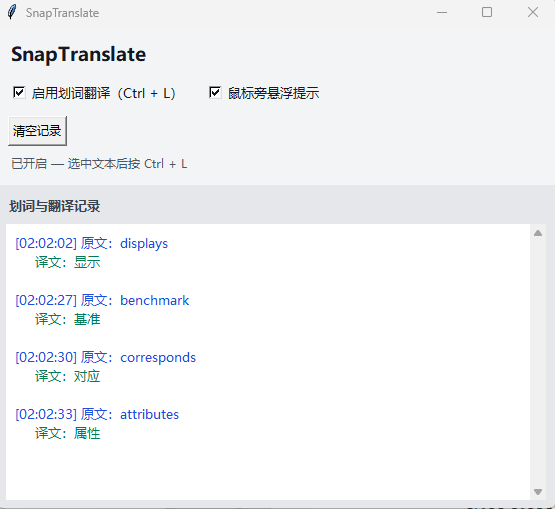
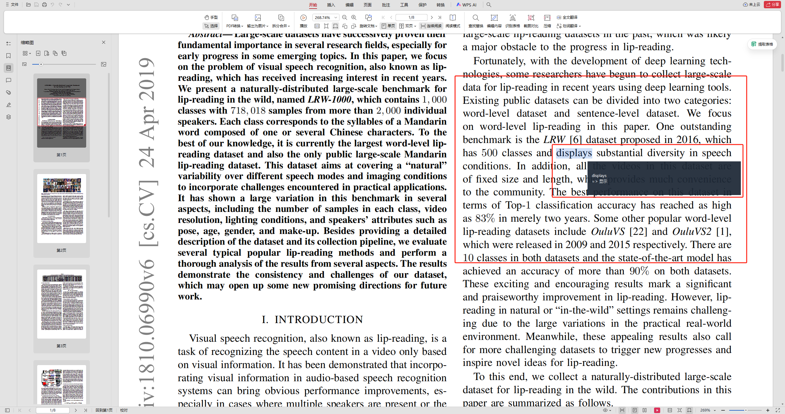

# SnapTranslate — Select & Translate (Windows)

**SnapTranslate** is a small **Windows** desktop tool: select text in any app, press **`Ctrl + L`**, and see a **Simplified Chinese** translation. The main window lets you **toggle** translation on/off, **view history** (original + result), and optionally show a **floating tooltip** near the cursor.

**Entry point:** [`main.py`](main.py) — class `TranslatorApp`.





---

## Features (English)

| Feature | Description |
|--------|-------------|
| Global hotkey | **`Ctrl + L`** after selecting text (simulates copy, then translates clipboard content). |
| GUI | Tkinter window: enable/disable translation, optional floating popup, scrollable log. |
| Source language | **`sl=auto`** — Google-style auto detection (whatever their public endpoint supports). |
| Target language | Fixed to **`zh-CN`** (Simplified Chinese) in `translate()`; change `tl=` in code for other targets. |
| Performance | LRU cache for repeated phrases; network calls use `requests` with a short timeout. |

---

## Requirements (English)

- **OS:** Windows (uses `ctypes` + `user32` for hotkeys and simulated `Ctrl+C`).
- **Python:** 3.10+ recommended (code uses `list[str]` style type hints).
- **Standard library:** `tkinter` (usually bundled with official Windows Python).
- **Packages:** see [`requirements.txt`](requirements.txt) — `pyperclip`, `requests`.

---

## Installation (English)

```powershell
cd path\to\SnapTranslate
pip install -r requirements.txt
```

---

## Usage (English)

```powershell
python main.py
```

1. Leave the window open (closing it exits the app and unregisters the hotkey).
2. In a browser, PDF reader, editor, etc., **select** the text you want.
3. Press **`Ctrl + L`**.
4. Check the **log** in the main window; if **“floating tooltip”** is enabled, a small window appears near the mouse.

### UI controls

| Control | Effect |
|--------|--------|
| **Enable select-translate (Ctrl + L)** | When off, the hotkey does nothing (no copy/translate). |
| **Floating tooltip near cursor** | When off, only the main window shows results. |
| **Clear log** | Clears the history text area. |

---

## Customization (English)

- **Hotkey:** In [`main.py`](main.py), change `MOD_CONTROL`, `VK_L`, or `HOTKEY_ID` / `RegisterHotKey` arguments.
- **Target language:** In `translate()`, change `tl=zh-CN` (e.g. `en`, `ja`).
- **Max selection length:** `MAX_TEXT_LENGTH` (default 120 characters).

---

## Troubleshooting (English)

- **Hotkey does nothing:** Another app may own `Ctrl + L`; change the key in code.
- **“No text detected”:** Some apps block simulated `Ctrl+C`; try another window or copy manually first.
- **`Too early to create variable`:** Tk variables are created only after `tk.Tk()` in `_build_ui()` — do not move `StringVar`/`BooleanVar` before the root window.

---

## Disclaimer (English)

Translation uses a **public Google Translate–style HTTP endpoint** (`translate.googleapis.com`). It is **not** an official paid API; availability and terms may change. Use at your own discretion.

---

---

# SnapTranslate — 划词翻译（Windows）

**SnapTranslate（划词快译）** 可在任意软件中**选中文字**后按 **`Ctrl + L`**，将选区复制并翻译成**简体中文**。主窗口可**开关**翻译、**查看历史**（原文 + 译文），并可选择是否在**鼠标旁**显示悬浮提示。

**程序入口：** [`main.py`](main.py)，核心类为 `TranslatorApp`。

---

## 功能说明（中文）

| 功能 | 说明 |
|------|------|
| 全局热键 | 选中文本后按 **`Ctrl + L`**（程序会模拟复制，再对剪贴板内容请求翻译）。 |
| 图形界面 | Tkinter：开关翻译、可选悬浮提示、可滚动的划词记录。 |
| 源语言 | **`sl=auto`**，由接口自动识别（范围与 Google 翻译类服务相近）。 |
| 目标语言 | 代码中固定为 **`zh-CN`（简体中文）**；其他语言需改 `translate()` 里的 `tl=`。 |
| 性能 | 相同句子有缓存；网络请求带较短超时。 |


---

## 环境要求（中文）

- **系统：** Windows（通过 `ctypes` 调用 `user32` 注册热键、模拟 `Ctrl+C`）。
- **Python：** 建议 3.10+（使用了 `list[str]` 等类型注解）。
- **标准库：** `tkinter`（官方 Windows 版 Python 一般已自带）。
- **第三方库：** 见 [`requirements.txt`](requirements.txt)：`pyperclip`、`requests`。

---

## 安装（中文）

```powershell
cd 你的\SnapTranslate\项目目录
pip install -r requirements.txt
```

---

## 使用（中文）

```powershell
python main.py
```

1. **不要关主窗口**（关闭即退出并注销热键）。
2. 在浏览器、PDF、编辑器等软件里**选中**要翻译的文字。
3. 按 **`Ctrl + L`**。
4. 在主窗口**记录区**查看结果；若勾选**鼠标旁悬浮提示**，会在指针附近短暂显示。

### 界面选项

| 选项 | 作用 |
|------|------|
| **启用划词翻译（Ctrl + L）** | 取消后按热键不会复制、不会请求翻译。 |
| **鼠标旁悬浮提示** | 取消后仅在主窗口文本区显示。 |
| **清空记录** | 清空下方历史。 |

---

## 自定义（中文）

- **修改热键：** 在 [`main.py`](main.py) 中调整 `MOD_CONTROL`、`VK_L` 或 `RegisterHotKey` 相关参数。
- **修改目标语言：** 在 `translate()` 中把 `tl=zh-CN` 改为 `en`、`ja` 等。
- **最长划词长度：** 常量 `MAX_TEXT_LENGTH`（默认 120 字符）。

---

## 常见问题（中文）

- **按热键没反应：** 可能被其他软件占用 `Ctrl + L`，请在代码里更换组合键。
- **提示未检测到文本：** 部分软件禁止模拟 `Ctrl+C`，可换窗口或先手动复制再试。
- **变量创建过早报错：** `StringVar` / `BooleanVar` 已在 `_build_ui()` 里、`tk.Tk()` **之后**创建；请勿在创建根窗口前实例化它们。

---

## 说明（中文）

翻译请求走 **公开的 Google 翻译风格 HTTP 接口**（`translate.googleapis.com`），**不是**官方付费 API，稳定性与条款可能变化，请自行斟酌使用。
