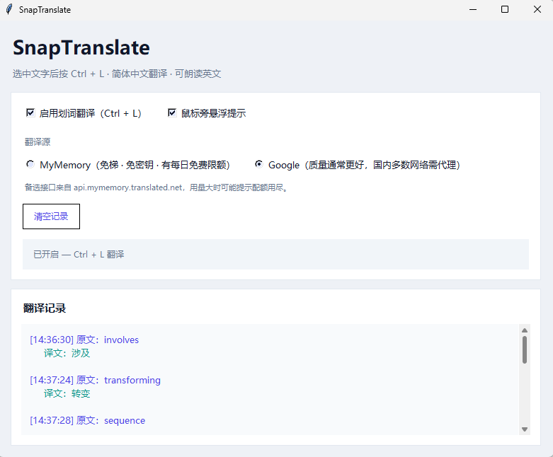
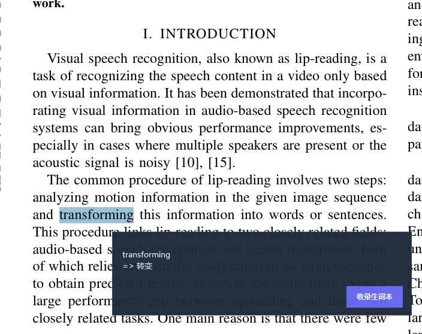
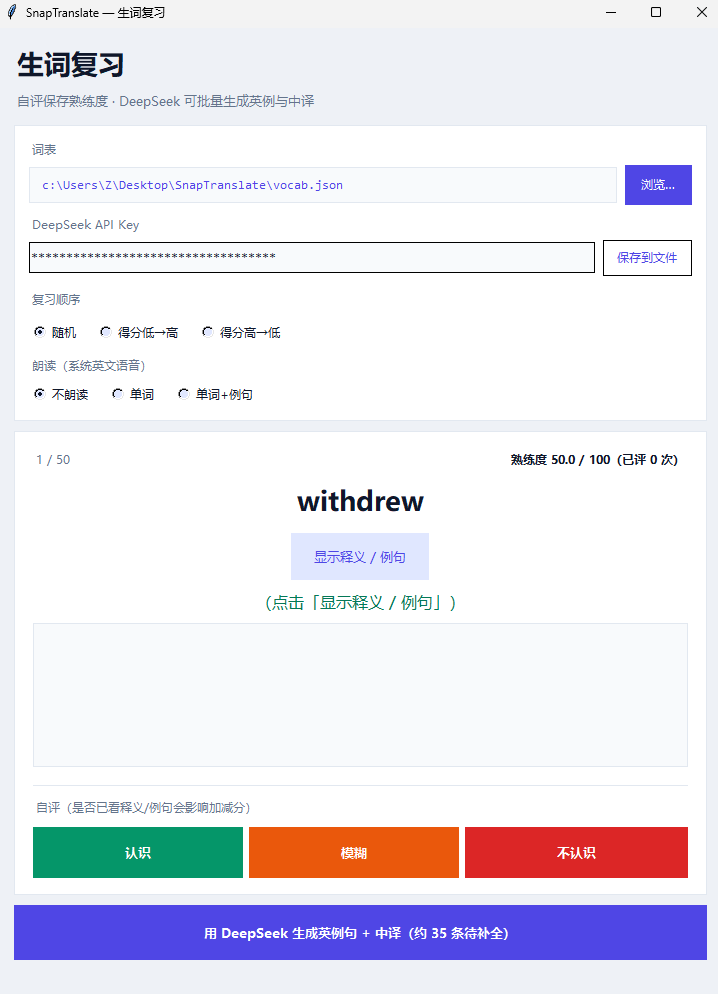

# SnapTranslate

Windows 下的**划词翻译**、**本地生词本**与**复习 / DeepSeek 例句生成**小工具。


---

# 中文版

## 简介

在任意软件中**选中文字**，按下 **`Ctrl + L`**，程序会模拟复制选区并调用在线翻译接口，将内容译为**简体中文**。翻译结果可显示在主窗口日志中，也可通过**悬浮窗**显示在鼠标附近；支持把当前译文**一键写入**同目录下的 `vocab.json` 生词本。

另提供独立程序 **`vocab_review.py`**：按熟悉程度**打分**、可选**朗读**、并用 **DeepSeek API** 为空白例句批量生成**英文例句 + 中文整句翻译**。

---

## 界面预览


### 划词翻译主窗口（`main.py`）

展示标题与副标题、**启用划词翻译**、**鼠标旁悬浮提示**、**翻译源**（MyMemory / Google）、**清空记录**、状态条与**翻译记录**列表。



### 悬浮翻译提示

开启「鼠标旁悬浮提示」后，划词翻译成功时可在指针附近显示深色小窗，展示「原文 ⇒ 译文」，并可点击 **收录生词本** 写入 `vocab.json`。



### 生词复习窗口（`vocab_review.py`）

包含词表路径与 DeepSeek Key、**复习顺序**（随机 / 按分排序）、**朗读模式**、当前词条与熟练度、释义与例句区域（例句中**词条加粗**）、**认识 / 模糊 / 不认识**自评，以及底部 **DeepSeek 批量生成例句** 与运行日志。



---

## 功能详解（中文）

### 一、划词翻译 — [`main.py`](main.py) · `TranslatorApp`

| 能力 | 说明 |
|------|------|
| **全局热键** | 默认 **`Ctrl + L`**（Windows `RegisterHotKey`）。选中文本后触发；内部通过 **`Ctrl+C`** 将选区送入剪贴板再读取（部分软件可能拦截模拟按键）。 |
| **翻译源** | 界面二选一：**MyMemory**（免密钥，国内多数网络可直接访问，有免费额度限制）；**Google gtx**（常见为质量更好，国内通常需能访问 Google 的网络）。 |
| **目标语言** | 固定输出 **简体中文（zh-CN）**；更换其他语言需改源码中接口参数。 |
| **长度限制** | 单次划词参与翻译的文本长度上限由 `MAX_TEXT_LENGTH` 控制（默认 **120** 字符），过长会截断并加省略号。 |
| **网络** | 对超时与连接类错误进行**有限次重试**；超时时间可在 `TRANSLATE_TIMEOUT`、`TRANSLATE_RETRIES` 中调整。 |
| **缓存** | 对相同原文的翻译结果使用 **LRU 缓存**，减轻重复请求压力。 |
| **主界面** | 卡片式浅色主题：开关项、翻译源单选、清空日志、状态说明、可滚动翻译记录（原文/译文分色显示）。 |
| **悬浮窗** | 可选；置顶、半透明；展示两行译文提示；提供 **收录生词本**（异步写入 JSON）。 |
| **英文朗读** | 当划词内容**像英文**（启发式判断）时，可在后台通过 Windows **System.Speech**（PowerShell）朗读原文，与翻译请求并行。 |
| **生词本写入** | 新词条包含：`word`、`meaning`（当前为译文语义）、`example` / `example_zh` 空串、`score` 默认 50、`reviews` 0。 |

### 二、生词复习 — [`vocab_review.py`](vocab_review.py) · `VocabReviewApp`

| 能力 | 说明 |
|------|------|
| **词表** | 默认加载项目目录 **`vocab.json`**；支持在界面中更换 JSON 路径。 |
| **复习顺序** | **随机**；**得分从低到高**（优先薄弱项）；**得分从高到低**（优先已掌握项）。切换顺序会重新排序并回到队列起点。 |
| **卡片交互** | 显示英文/词条；点击 **显示释义 / 例句** 展开中文释义与英例句、句译；隐藏后可继续自评。 |
| **例句展示** | 英文例句中对应当前 **`word`** 的片段**加粗**（不区分大小写，支持短语）。 |
| **评分体系** | **认识 / 模糊 / 不认识**。若在本张卡片上**已点开**释义/例句再作答，加减分幅度与「未看提示」不同；分数限制在 **0～100**，并写入 `reviews` 计数。 |
| **朗读** | **不朗读**；只读词条；读词条再读英文例句（系统英文 TTS）。 |
| **DeepSeek** | 对 `example` 或 `example_zh` 仍缺省的条目批量请求 **deepseek-chat**，解析 JSON，写回文件；需 **API Key**（界面或 **`api_key.txt` 首行**）。 |
| **余额与错误** | 遇 **402 / Insufficient Balance** 等会中止批量任务并提示充值或换 Key。 |

### 三、重置熟练度 — [`reset_vocab_scores.py`](reset_vocab_scores.py)

无 GUI：将词表内每条 **`score` 置为 50**、**`reviews` 置为 0**，整文件安全写回。

```powershell
python reset_vocab_scores.py
python reset_vocab_scores.py "D:\path\to\vocab.json"
```

---

## 快速开始（中文）

```powershell
cd path\to\SnapTranslate
pip install -r requirements.txt
python main.py
python vocab_review.py
```

---

## 项目结构（中文）

| 文件 | 作用 |
|------|------|
| [`main.py`](main.py) | 划词翻译主程序 |
| [`vocab_review.py`](vocab_review.py) | 生词复习、评分、DeepSeek 例句 |
| [`reset_vocab_scores.py`](reset_vocab_scores.py) | 命令行重置分数与复习次数 |
| [`vocab.json`](vocab.json) | 生词本数据 |
| [`api_key.txt`](api_key.txt) | （可选）DeepSeek 密钥，**勿提交公开仓库** |
| [`requirements.txt`](requirements.txt) | Python 依赖 |
| [`image/`](image/) | 界面截图（见 [`image/SCREENSHOTS.md`](image/SCREENSHOTS.md)） |

---

## 环境与依赖（中文）

- **系统：** Windows（热键与模拟按键依赖 `user32`）。  
- **Python：** 建议 **3.10+**。  
- **标准库：** `tkinter`（官方 Windows 版 Python 一般自带）。  
- **第三方库：** `pyperclip`、`requests`（主程序）；`openai`（复习程序调 DeepSeek 兼容接口）。

---

## 自定义提示（中文）

- 修改热键：`MOD_CONTROL`、`VK_L`、`RegisterHotKey`（[`main.py`](main.py)）。  
- 修改最长划词：`MAX_TEXT_LENGTH`。  
- 修改翻译重试与超时：`TRANSLATE_RETRIES`、`TRANSLATE_TIMEOUT`。  

---

## 常见问题（中文）

- **热键无效：** 被其他软件占用，或已关闭「启用划词翻译」。  
- **提示未检测到文本：** 目标程序禁止模拟复制，可换应用或先手动复制。  
- **Google 超时：** 换 **MyMemory** 或检查代理。  
- **MyMemory 配额提示：** 免费每日限额，可次日再试或换 Google。  
- **DeepSeek 402：** 账户余额不足。  

---

## 免责声明（中文）

翻译接口（Google、MyMemory 等）多为公共服务，**非官方商业 SLA**；DeepSeek 使用须遵守其平台条款。工具仅供学习及个人效率场景，使用者自担网络与合规风险。

---

# English Version

## Introduction

**SnapTranslate** helps on **Windows** when you **select text** in any application and press **`Ctrl + L`**: it simulates **copy**, reads the clipboard, and translates the content into **Simplified Chinese**. Results appear in the **main log** and optionally in a **floating popup** near the cursor. You can **save** the current pair to a local **`vocab.json`** vocabulary file.

**`vocab_review.py`** is a separate **review** app: **score** each card (**know / vague / don’t know**), optional **TTS**, and **DeepSeek** batch fill for **English examples + Chinese sentence translations** where fields are empty.

---

## UI previews


### Main window (`main.py`)

Header, **enable hotkey**, **floating tooltip** toggle, **translation source** (MyMemory / Google), **clear log**, status strip, and scrollable **translation history**.


### Floating popup

When enabled, a small **always-on-top** popup shows **source ⇒ translation** and a **Save to vocabulary** button that appends to `vocab.json`.


### Vocabulary review (`vocab_review.py`)

Path & API key, **study order**, **read-aloud mode**, word card & **mastery score**, meaning & **bolded** example sentence, **know / vague / don’t know** buttons, **DeepSeek batch example** button, and log area.


---

## Features (detailed, English)

### A. Select & translate — [`main.py`](main.py) · `TranslatorApp`

| Feature | Details |
|--------|---------|
| **Global hotkey** | Default **`Ctrl + L`** via `RegisterHotKey`. Selection is copied with simulated **Ctrl+C**; some apps block synthetic input. |
| **Translation backends** | **MyMemory** (no API key, often works without VPN to Google, daily free quota). **Google gtx** (often higher quality; may need Google-reachable network). |
| **Target language** | Fixed **Simplified Chinese (`zh-CN`)**; change in source if you need another target. |
| **Length cap** | `MAX_TEXT_LENGTH` (default **120**); longer text is truncated. |
| **Networking** | **Retries** on timeout / connection errors; tune `TRANSLATE_TIMEOUT` and `TRANSLATE_RETRIES`. |
| **Caching** | **LRU cache** on translation strings to reduce duplicate HTTP calls. |
| **Main UI** | Card-style light theme: toggles, source radios, clear log, status, colored log lines. |
| **Floating window** | Optional; shows translation snippet and **vocabulary save** (async JSON write). |
| **English TTS** | For likely-English selections, **Windows System.Speech** may read the source in a background thread. |
| **Vocabulary row shape** | `word`, `meaning` (translation as gloss), empty `example` / `example_zh`, `score` 50, `reviews` 0. |

### B. Vocabulary review — [`vocab_review.py`](vocab_review.py) · `VocabReviewApp`

| Feature | Details |
|--------|---------|
| **Word list** | Defaults to **`vocab.json`** next to the script; path can be changed in the UI. |
| **Order** | **Random**; **low score first**; **high score first**. Changing order rebuilds the queue from the start. |
| **Card** | Show term; **reveal** meaning & bilingual example; **keyword bold** in the English sentence. |
| **Scoring** | **Know / vague / don’t know**; whether **reveal** was used on the **current** card changes point deltas; score clamped **0–100**, `reviews` incremented. |
| **Read-aloud** | Off; word only; word + English example (system EN voice). |
| **DeepSeek** | Calls **deepseek-chat** for items missing `example` or `example_zh`; requires **API key** (UI or **`api_key.txt`** first line). |
| **Errors** | e.g. **402 Insufficient balance** stops batch generation with a clear warning. |

### C. Reset scores — [`reset_vocab_scores.py`](reset_vocab_scores.py)

CLI only: sets every item’s **`score` to 50** and **`reviews` to 0**, atomically rewrites the JSON file.

```powershell
python reset_vocab_scores.py
python reset_vocab_scores.py "D:\path\to\vocab.json"
```

---

## Quick start (English)

```powershell
cd path\to\SnapTranslate
pip install -r requirements.txt
python main.py
python vocab_review.py
```

---

## Repository layout (English)

| File | Role |
|------|------|
| [`main.py`](main.py) | Hotkey translate app |
| [`vocab_review.py`](vocab_review.py) | Review, scoring, DeepSeek examples |
| [`reset_vocab_scores.py`](reset_vocab_scores.py) | CLI reset of `score` / `reviews` |
| [`vocab.json`](vocab.json) | Vocabulary JSON |
| [`api_key.txt`](api_key.txt) | Optional DeepSeek key (**do not commit** publicly) |
| [`requirements.txt`](requirements.txt) | Pip dependencies |
| [`image/`](image/) | UI screenshots (see [`image/SCREENSHOTS.md`](image/SCREENSHOTS.md)) |

---

## Requirements (English)

- **OS:** Windows (`user32` hotkey & synthetic key events).  
- **Python:** **3.10+** recommended.  
- **Stdlib:** `tkinter` (bundled with official Windows Python).  
- **Packages:** `pyperclip`, `requests` (main app); `openai` SDK for DeepSeek-compatible API in the review app.

---

## Customization hints (English)

- Hotkey: `MOD_CONTROL`, `VK_L`, `RegisterHotKey` in [`main.py`](main.py).  
- Max selection length: `MAX_TEXT_LENGTH`.  
- Retries / timeouts: `TRANSLATE_RETRIES`, `TRANSLATE_TIMEOUT`.

---

## FAQ (English)

- **Hotkey dead:** Another app grabbed **Ctrl+L**, or translate toggle is off.  
- **No text detected:** Target app blocks synthetic copy; try elsewhere or copy manually first.  
- **Google timeouts:** Use **MyMemory** or fix proxy/VPN.  
- **MyMemory quota:** Free tier limits; retry later or use Google if reachable.  
- **DeepSeek 402:** Top up or use another key.

---

## Disclaimer (English)

Translation endpoints (Google, MyMemory, etc.) are **public / unofficial** services without a commercial SLA. **DeepSeek** usage must follow [DeepSeek](https://www.deepseek.com/) terms and billing. This project is for learning and personal productivity; you are responsible for network use and compliance.
